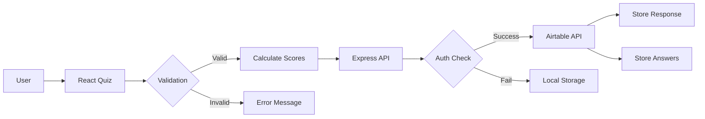

# Debt Assessment Platform - Complete System Overview

## 🎯 Application Purpose

A web-based quiz application designed to assess users' debt profiles and readiness for alternative financial solutions. The platform collects anonymous data to help design a collaborative debt management system tailored to community needs.

## 🏗️ Architecture Overview

```
┌─────────────────┐     ┌──────────────┐     ┌──────────────┐
│   React SPA     │────▶│ Express API  │────▶│   Airtable   │
│   (Frontend)    │     │   (Backend)  │     │  (Database)  │
└─────────────────┘     └──────────────┘     └──────────────┘
        ↓                        ↓                     ↓
   [User Browser]         [AWS/Server]          [Cloud DB]
```

## 📋 Core Features

### 1. Interactive Quiz System
- **11 Questions** covering debt types, financial situations, and attitudes
- **Question Types**:
  - Multiple choice (standard selection)
  - Drag-and-drop ranking (debt prioritization)
  - Multi-select (debt accumulation factors)
  - Freeform text (optional user insights)
  - Contact collection (optional follow-up)

### 2. Intelligent Scoring Engine
- **6 Debt Profiles** analyzed:
  - Student Loan Struggler
  - Credit Card Cycler
  - Medical Debt Survivor
  - Asset-Secured Borrower
  - Multi-Generational Carrier
  - Solidarity Participant

- **Readiness Assessment**:
  - Low (0-33%): Still exploring options
  - Medium (34-66%): Open to alternatives
  - High (67-100%): Ready for radical change

### 3. Personalized Results
- Primary debt profile identification
- Match percentage calculation
- Customized recommendations
- Visual score breakdowns
- Optional contact for platform updates

## 🛠️ Technical Stack

### Frontend
```javascript
{
  "framework": "React 18.3 + TypeScript",
  "build": "Vite 5.4",
  "styling": "Tailwind CSS 3.4",
  "icons": "Lucide React",
  "routing": "Component-based state management"
}
```

**Key Components**:
- `LandingPage.tsx` - Initial user engagement
- `Quiz.tsx` - Question flow and interaction handling
- `Results.tsx` - Score calculation and display
- `scoring.ts` - Profile matching algorithm

### Backend
```javascript
{
  "runtime": "Node.js 18+",
  "framework": "Express 5.1",
  "security": [
    "Helmet.js (headers)",
    "CORS (origin control)",
    "Rate limiting (10 submissions/hour)",
    "Input validation"
  ],
  "api": "RESTful endpoints"
}
```

**API Endpoints**:
- `GET /api/health` - System status check
- `POST /api/submit-quiz` - Process quiz responses

### Database
```yaml
Platform: Airtable
Tables:
  - Quiz Responses (15 fields)
  - Individual Answers (8 fields)
Authentication: API Key (server-side only)
```

## 🔒 Security Architecture

### Multi-Layer Protection
1. **API Key Security**
   - Keys stored server-side only
   - Never exposed to frontend
   - Environment variable management

2. **Request Protection**
   - Rate limiting: 10 submissions/hour/IP
   - CORS restrictions
   - Request size limits (10MB max)
   - HTTPS enforcement

3. **Data Handling**
   - Input validation
   - SQL injection prevention
   - XSS protection via React
   - Local storage fallback for failures

## 🚀 Deployment Infrastructure

### Production Setup (AWS via FlightControl)

```json
{
  "service": "ECS Fargate",
  "region": "us-east-1",
  "resources": {
    "cpu": "0.5 vCPU",
    "memory": "1GB RAM",
    "instances": "1-3 (auto-scaling)"
  },
  "features": [
    "Load balancer",
    "SSL/TLS certificates",
    "CloudWatch monitoring",
    "Zero-downtime deployments"
  ]
}
```

### Alternative Deployment Options
- **Netlify**: Static + Functions
- **Vercel**: Edge Functions
- **Railway**: Container deployment
- **Heroku**: Traditional PaaS
- **Self-hosted**: VPS with PM2

## 📊 Data Flow



## 🗂️ File Structure

```
debt-assess/
├── src/                    # Frontend source
│   ├── components/         # React components
│   ├── services/           # API integrations
│   ├── utils/              # Helper functions
│   ├── types/              # TypeScript definitions
│   └── data/               # Questions dataset
├── server.js               # Express backend
├── netlify/functions/      # Serverless functions
├── flightcontrol.json      # AWS deployment config
├── .env.example            # Environment template
└── dist/                   # Production build
```

## 🔧 Configuration Files

### Environment Variables
```bash
# Server Configuration
PORT=3001
NODE_ENV=production

# Airtable Credentials
AIRTABLE_BASE_ID=appXXXXXXXXXX
AIRTABLE_API_KEY=patXXXXXXXXXX

# API Endpoints
VITE_API_ENDPOINT=https://api.domain.com/submit-quiz
```

### Build Scripts
```json
{
  "dev": "Frontend development",
  "server:dev": "Backend development",
  "dev:all": "Full stack development",
  "build": "Production build",
  "start": "Production server"
}
```

## 📈 Performance Metrics

- **Page Load**: < 2 seconds
- **Quiz Completion**: ~5 minutes average
- **API Response**: < 500ms
- **Uptime Target**: 99.9%
- **Concurrent Users**: 100+ supported

## 🔄 Development Workflow

1. **Local Development**
   ```bash
   npm run dev:all  # Starts both frontend and backend
   ```

2. **Testing**
   - Manual testing via browser
   - API testing with curl/Postman
   - Airtable verification

3. **Deployment**
   - Push to GitHub main branch
   - Automatic CI/CD via FlightControl
   - Health checks before traffic routing
   - Automatic rollback on failures

## 🎨 User Experience Flow

1. **Landing** → Introduction and context
2. **Quiz** → 11 progressive questions
3. **Processing** → Score calculation
4. **Results** → Personalized insights
5. **Submission** → Data to Airtable
6. **Fallback** → Local storage if API fails

## 💰 Cost Structure

### AWS Production Costs (Monthly)
- Fargate: $20-30
- Load Balancer: $20
- Data Transfer: $5-10
- CloudWatch: $5
- **Total**: ~$50-65/month

### Airtable Costs
- Free tier: 1,200 records/base
- Team: $20/user/month (25,000 records)

## 🔐 Privacy & Compliance

- No personally identifiable information required
- Optional contact information
- Data stored in US regions
- SSL/TLS encryption in transit
- No cookies or tracking pixels
- GDPR-friendly architecture

## 📊 Analytics & Monitoring

### Available Metrics
- Submission counts
- Profile distribution
- Readiness levels
- Completion rates
- Error tracking
- Performance monitoring

### Monitoring Tools
- CloudWatch (AWS)
- FlightControl dashboard
- Airtable interface
- Server logs

## 🚦 System Status Indicators

- ✅ **Healthy**: API returns 200, Airtable connected
- ⚠️ **Degraded**: Slow responses, high memory
- ❌ **Down**: API unreachable, database errors

## 🔮 Future Enhancements

### Potential Features
- User accounts and history
- Advanced analytics dashboard
- Multi-language support
- Mobile app version
- API for third-party integration
- Machine learning insights
- Debt reduction calculator
- Community features

### Scalability Options
- Database migration to PostgreSQL
- Microservices architecture
- CDN implementation
- Caching layer (Redis)
- Queue system (SQS/RabbitMQ)
- GraphQL API

## 📝 Maintenance Requirements

### Regular Tasks
- Monitor Airtable storage limits
- Review rate limiting rules
- Update dependencies monthly
- Check SSL certificate renewal
- Analyze error logs
- Backup data regularly

### Update Procedures
1. Test in development
2. Deploy to staging (if available)
3. Run health checks
4. Deploy to production
5. Monitor for 24 hours

## 🎯 Success Metrics

- **Technical**: 99.9% uptime, <500ms response
- **User**: 80% completion rate
- **Data**: 1000+ responses collected
- **Cost**: Under $100/month operational

## 🤝 Support & Documentation

- **Code**: GitHub repository
- **Deployment**: FlightControl dashboard
- **Database**: Airtable workspace
- **Monitoring**: CloudWatch logs
- **Issues**: GitHub Issues tracker

---

This platform represents a modern, secure, and scalable approach to collecting sensitive financial data while maintaining user privacy and providing valuable insights for building community-driven financial solutions.